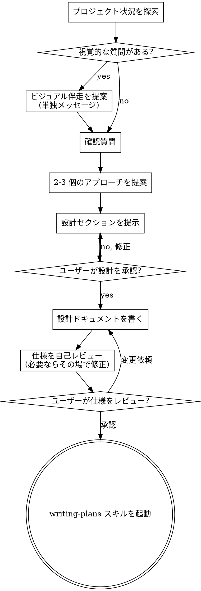

# アイデアを設計に育てるブレインストーミング

自然な共同対話を通じて、アイデアを十分に形になった設計や仕様へ変える。

まず現在のプロジェクト状況を理解し、その後、一度に一つずつ質問してアイデアを磨く。何を作るのか理解できたら設計を提示し、ユーザーの承認を得る。

<HARD-GATE>
設計を提示してユーザーが承認するまで、実装スキルの起動、コード作成、プロジェクトの雛形作成、その他いかなる実装作業も行ってはならない。これは、どれほど単純に見えるプロジェクトにも適用される。
</HARD-GATE>

## アンチパターン: 「これは単純すぎて設計はいらない」

すべてのプロジェクトでこのプロセスを通る。Todo リスト、単一関数のユーティリティ、設定変更であっても同じ。単純なプロジェクトほど、未確認の思い込みが無駄な作業を生む。設計は短くてもよいが、必ず提示して承認を得ること。

## チェックリスト

以下の各項目にタスクを作り、順番に完了すること。

1. **プロジェクト状況を探索する** - ファイル、ドキュメント、最近のコミットを確認する
2. **ビジュアル伴走を提案する** - 視覚的な質問が出そうな場合。これは単独メッセージであり、確認質問と混ぜない。下の「ビジュアル伴走」を参照
3. **確認質問をする** - 一度に一つずつ、目的・制約・成功基準を理解する
4. **2-3 個のアプローチを提案する** - トレードオフと推奨案を含める
5. **設計を提示する** - 複雑さに応じたセクションで提示し、各セクション後にユーザー承認を得る
6. **設計ドキュメントを書く** - `docs/superpowers/specs/YYYY-MM-DD-<topic>-design.md` に保存してコミットする
7. **仕様を自己レビューする** - プレースホルダー、矛盾、曖昧さ、スコープを簡単に確認する
8. **ユーザーが書かれた仕様をレビューする** - 実装へ進む前に、仕様ファイルを確認してもらう
9. **実装へ移行する** - writing-plans スキルを起動して実装計画を作る

## プロセスの流れ

**終着点は writing-plans の起動である。** frontend-design、mcp-builder、その他の実装スキルを起動してはならない。brainstorming の後に起動する唯一のスキルは writing-plans である。

## プロセス

**アイデアを理解する:**

- まず現在のプロジェクト状態を確認する。ファイル、ドキュメント、最近のコミットを見る
- 詳細質問の前にスコープを評価する。リクエストが複数の独立サブシステムを含む場合は、すぐに分解が必要だと伝える
- 単一仕様として大きすぎる場合は、独立した部品、関係性、構築順序へ分解し、最初のサブプロジェクトを通常の設計フローで進める
- 適切なスコープなら、一度に一つずつ質問してアイデアを磨く
- 可能なら複数選択式の質問を好む。ただし自由回答でもよい
- 1 メッセージにつき質問は一つだけ。深掘りが必要なら複数メッセージに分ける
- 目的、制約、成功基準の理解に集中する

**アプローチを探索する:**

- 2-3 個の異なるアプローチを、トレードオフ付きで提案する
- 推奨案と理由を会話的に提示する
- 推奨案を先に示し、なぜそれがよいか説明する

**設計を提示する:**

- 何を作るのか理解できたと思ったら設計を提示する
- 各セクションの長さは複雑さに合わせる。単純なら数文、複雑なら 200-300 語程度まで
- 各セクション後に「ここまで合っているか」を確認する
- アーキテクチャ、コンポーネント、データフロー、エラー処理、テストを扱う
- 意味が通らない部分があれば、戻って確認する準備をしておく

**分離と明確さのために設計する:**

- システムを、明確な責務を持ち、定義されたインターフェースでやり取りし、独立して理解・テストできる小さな単位に分ける
- 各単位について「何をするか」「どう使うか」「何に依存するか」を答えられるようにする
- 内部を読まずに役割を理解できるか、内部を変えても利用側を壊さないかを確認する
- 小さく境界のはっきりした単位は、作業する側にとっても扱いやすく、編集の信頼性が高い。ファイルが大きくなりすぎる場合は、責務過多の兆候である

**既存コードベースで作業する:**

- 変更提案の前に現在の構造を探索し、既存パターンに従う
- 作業に影響する既存コードの問題がある場合は、設計に必要最小限の改善を含める
- 無関係なリファクタリングを提案しない。現在の目的に役立つことへ集中する

## 設計後

**ドキュメント:**

- 検証済みの設計を `docs/superpowers/specs/YYYY-MM-DD-<topic>-design.md` に書く
  - ユーザーの保存場所指定があれば、それを優先する
- elements-of-style:writing-clearly-and-concisely スキルが使えるなら使う
- 設計ドキュメントを git にコミットする

**仕様の自己レビュー:**

設計ドキュメントを書いた後、新しい目で確認する。

1. **プレースホルダー確認:** "TBD"、"TODO"、未完成セクション、曖昧な要件はないか。あれば直す
2. **内部整合性:** セクション同士が矛盾していないか。アーキテクチャは機能説明と合っているか
3. **スコープ確認:** 単一の実装計画に収まるか。分解が必要ではないか
4. **曖昧さ確認:** 要件が二通りに解釈できないか。できるなら一つを選び、明示する

問題はその場で修正する。再レビューは不要で、そのまま直して進む。

**ユーザーレビューのゲート:**

仕様レビューが通ったら、実装へ進む前にユーザーへ仕様確認を依頼する。

> "Spec written and committed to `<path>`. Please review it and let me know if you want to make any changes before we start writing out the implementation plan."

ユーザーの返答を待つ。変更依頼があれば修正し、仕様レビューを再実行する。ユーザーが承認してからのみ先へ進む。

**実装:**

- writing-plans スキルを起動して詳細な実装計画を作る
- 他のスキルは起動しない。次のステップは writing-plans である

## 重要原則

- **一度に一つの質問** - 多数の質問で圧倒しない
- **複数選択を好む** - 可能なら自由回答より答えやすい
- **YAGNI を徹底する** - すべての設計から不要な機能を削る
- **代替案を探索する** - 決める前に必ず 2-3 個のアプローチを出す
- **段階的に検証する** - 設計を提示し、承認を得てから進む
- **柔軟でいる** - 意味が通らないときは戻って確認する

## ビジュアル伴走

ブレインストーミング中にモックアップ、図、視覚的な選択肢を見せるためのブラウザベースの伴走機能。これはモードではなくツールである。ユーザーが伴走を受け入れても、すべての質問をブラウザで扱うという意味ではない。

**伴走の提案:** 今後の質問に視覚的な内容が含まれそうな場合、同意を得るために一度だけ提案する。
> "Some of what we're working on might be easier to explain if I can show it to you in a web browser. I can put together mockups, diagrams, comparisons, and other visuals as we go. This feature is still new and can be token-intensive. Want to try it? (Requires opening a local URL)"

**この提案は必ず単独メッセージにすること。** 確認質問、文脈要約、その他の内容と組み合わせてはならない。メッセージには上記の提案だけを含める。ユーザーの返答を待ってから続ける。断られたらテキストのみで進める。

**質問ごとの判断:** ユーザーが受け入れた後も、各質問ごとにブラウザを使うかターミナルを使うか判断する。基準は、**読んで理解するより、見た方が理解しやすいか**。

- **ブラウザを使う**: 視覚そのものが内容である場合。モックアップ、ワイヤーフレーム、レイアウト比較、アーキテクチャ図、並列のビジュアルデザインなど
- **ターミナルを使う**: 要件質問、概念的な選択肢、トレードオフ、スコープ判断など、答えが文章である場合

UI トピックだからといって自動的に視覚的な質問とは限らない。「この文脈で personality とは何か」は概念質問なのでターミナルを使う。「どの wizard レイアウトがよいか」は視覚質問なのでブラウザを使う。

ユーザーが伴走に同意したら、進む前に詳細ガイドを読む。
`skills/brainstorming/visual-companion.md`
