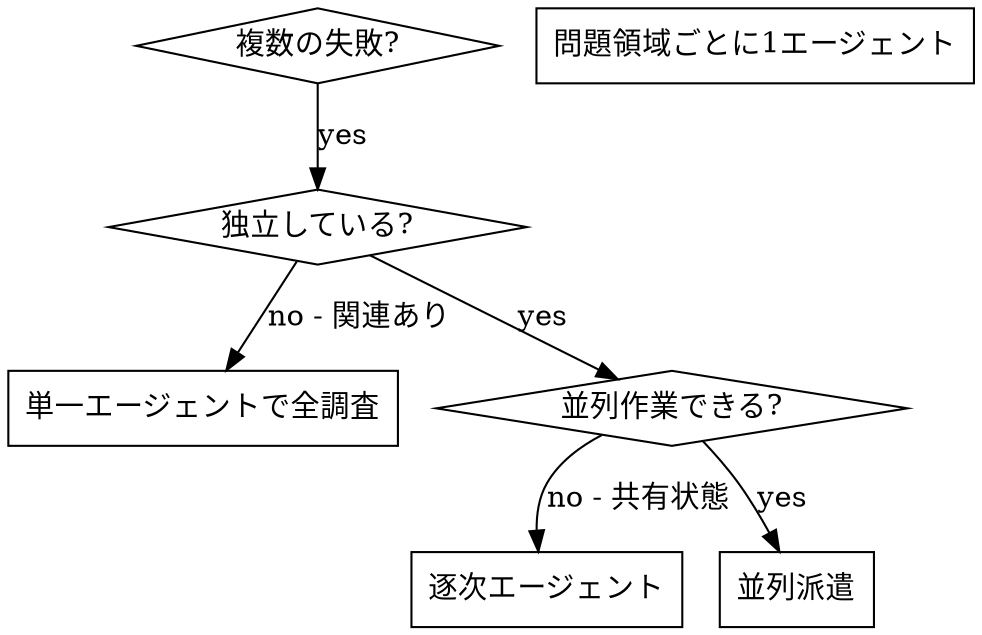

# 並列エージェントを派遣する

## 概要

専門エージェントへ、分離された文脈でタスクを委任する。指示と文脈を正確に作ることで、各エージェントを集中させ、成功させる。エージェントに現在セッションの文脈や履歴を継承させてはならない。必要なものだけを構築して渡す。これにより、自分の文脈は調整作業のために温存できる。

複数の無関係な失敗がある場合、順番に調査すると時間を浪費する。各調査が独立しているなら並列に進められる。

**中核原則:** 独立した問題領域ごとに 1 エージェントを派遣する。同時に作業させる。

## 使うタイミング



**使う場合:**

- 3 つ以上のテストファイルが異なる根本原因で失敗している
- 複数サブシステムが独立して壊れている
- 各問題が他の文脈なしに理解できる
- 調査間に共有状態がない

**使わない場合:**

- 失敗が関連している (一つの修正で他も直る可能性)
- システム全体状態の理解が必要
- エージェント同士が干渉する

## パターン

### 1. 独立領域を特定する

何が壊れているかで失敗をグループ化する。

- File A tests: tool approval flow
- File B tests: batch completion behavior
- File C tests: abort functionality

各領域は独立している。tool approval の修正は abort tests に影響しない。

### 2. 集中したエージェントタスクを作る

各エージェントに渡すもの:

- **具体的スコープ:** 一つのテストファイルまたはサブシステム
- **明確なゴール:** これらのテストを通す
- **制約:** 他のコードを変えない
- **期待出力:** 見つけたこと、直したことの要約

### 3. 並列に派遣する

```typescript
// Claude Code / AI environment
Task("Fix agent-tool-abort.test.ts failures")
Task("Fix batch-completion-behavior.test.ts failures")
Task("Fix tool-approval-race-conditions.test.ts failures")
// 3 つすべてが同時実行される
```

### 4. レビューして統合する

エージェントが戻ったら:

- 各要約を読む
- 修正が衝突していないか確認する
- フルテストスイートを実行する
- すべての変更を統合する

## エージェントプロンプト構造

良いプロンプトは:

1. **集中している** - 一つの明確な問題領域
2. **自己完結している** - 問題理解に必要な文脈がすべてある
3. **出力が具体的** - 何を返すべきか明確

```markdown
Fix the 3 failing tests in src/agents/agent-tool-abort.test.ts:

1. "should abort tool with partial output capture" - expects 'interrupted at' in message
2. "should handle mixed completed and aborted tools" - fast tool aborted instead of completed
3. "should properly track pendingToolCount" - expects 3 results but gets 0

These are timing/race condition issues. Your task:

1. Read the test file and understand what each test verifies
2. Identify root cause - timing issues or actual bugs?
3. Fix by:
   - Replacing arbitrary timeouts with event-based waiting
   - Fixing bugs in abort implementation if found
   - Adjusting test expectations if testing changed behavior

Do NOT just increase timeouts - find the real issue.

Return: Summary of what you found and what you fixed.
```

## よくある間違い

**悪い:** "Fix all the tests" - 広すぎてエージェントが迷う  
**良い:** "Fix agent-tool-abort.test.ts" - スコープが集中している

**悪い:** "Fix the race condition" - どこか分からない  
**良い:** エラーメッセージとテスト名を貼る

**悪い:** 制約なし - エージェントが全部リファクタするかもしれない  
**良い:** "Do NOT change production code" または "Fix tests only"

**悪い:** 出力が曖昧 - "Fix it"  
**良い:** "Return summary of root cause and changes"

## 使わない時

**関連する失敗:** 一つの修正が他を直す可能性がある。まず一緒に調査する。  
**全体文脈が必要:** システム全体を見ないと理解できない。  
**探索的デバッグ:** 何が壊れているかまだ分からない。  
**共有状態:** エージェントが同じファイルやリソースを編集して干渉する。

## 実例

**シナリオ:** 大きなリファクタリング後、3 ファイルで 6 つのテスト失敗

**失敗:**

- agent-tool-abort.test.ts: 3 failures (timing issues)
- batch-completion-behavior.test.ts: 2 failures (tools not executing)
- tool-approval-race-conditions.test.ts: 1 failure (execution count = 0)

**判断:** 独立領域。abort logic、batch completion、race conditions は別。

**派遣:**

```text
Agent 1 -> Fix agent-tool-abort.test.ts
Agent 2 -> Fix batch-completion-behavior.test.ts
Agent 3 -> Fix tool-approval-race-conditions.test.ts
```

**結果:**

- Agent 1: timeouts を event-based waiting に置換
- Agent 2: event structure bug を修正
- Agent 3: async tool execution の完了待ちを追加

**統合:** すべて独立修正で衝突なし。フルスイート green。

**節約時間:** 3 問題を逐次ではなく並列に解決。

## 主な利点

1. **並列化** - 複数調査が同時に進む
2. **集中** - 各エージェントのスコープが狭く、文脈が少ない
3. **独立性** - エージェント同士が干渉しない
4. **速度** - 1 問題分の時間で 3 問題を解く

## 検証

エージェントが戻ったら:

1. **各要約をレビューする** - 何が変わったか理解する
2. **衝突を確認する** - 同じコードを編集していないか
3. **フルスイートを実行する** - 修正が一緒に動くか確認する
4. **スポットチェックする** - エージェントは体系的な間違いをすることがある

## 実世界での効果

デバッグセッション (2025-10-03) から:

- 3 ファイルで 6 failures
- 3 エージェントを並列派遣
- 全調査が同時完了
- 全修正が正常に統合
- エージェント変更の衝突ゼロ
