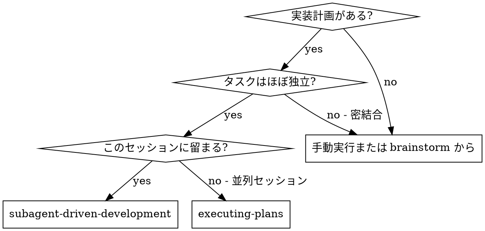
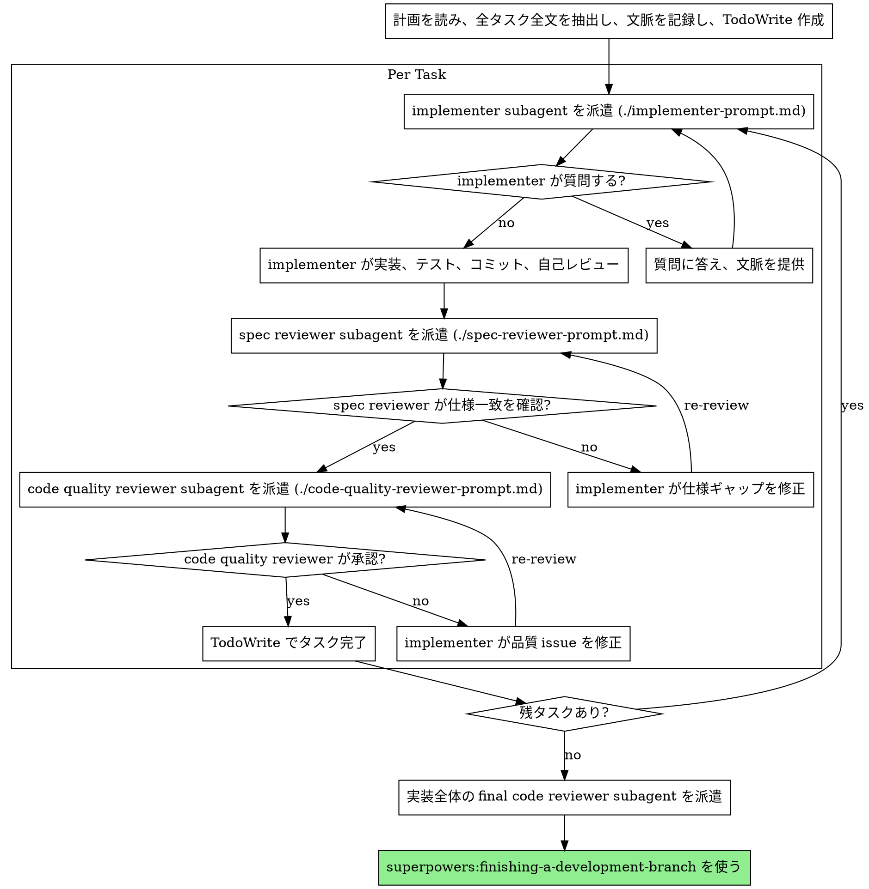

# サブエージェント駆動開発

各タスクごとに新しいサブエージェントを派遣し、各タスク後に二段階レビューを行って計画を実行する。最初に仕様準拠レビュー、その後にコード品質レビューを行う。

**なぜサブエージェントか:** 専門エージェントへ、分離された文脈でタスクを委任する。指示と文脈を正確に作ることで、集中して成功させる。サブエージェントに現在セッションの文脈や履歴を継承させてはならない。必要なものだけを構築して渡す。これにより、自分の文脈は調整作業に温存できる。

**中核原則:** タスクごとに新しいサブエージェント + 二段階レビュー (仕様、品質) = 高品質で速い反復。

**継続実行:** タスク間で human partner に確認するために停止しない。計画内の全タスクを止まらず実行する。停止理由は、解決できない BLOCKED、進捗を本当に妨げる曖昧さ、または全タスク完了のみ。"Should I continue?" や進捗要約は時間を浪費する。計画実行を頼まれたなら、実行する。

## 使うタイミング



**Executing Plans との違い:**

- 同じセッション (文脈切り替えなし)
- タスクごとに新しいサブエージェント (文脈汚染なし)
- 各タスク後に二段階レビュー: 仕様準拠、次にコード品質
- より速い反復 (タスク間で human-in-loop なし)

## プロセス



## モデル選択

コストを抑え速度を上げるため、各役割を扱える最小限の強さのモデルを使う。

**機械的な実装タスク** (孤立関数、明確な仕様、1-2 ファイル): 速く安いモデルを使う。計画が十分具体的なら、多くの実装タスクは機械的である。

**統合と判断が必要なタスク** (複数ファイル調整、パターン照合、デバッグ): 標準モデルを使う。

**アーキテクチャ、設計、レビュータスク:** 利用可能な最も高性能なモデルを使う。

**複雑さのシグナル:**

- 1-2 ファイルに触れ、完全な仕様がある -> 安いモデル
- 複数ファイルに触れ、統合懸念がある -> 標準モデル
- 設計判断や広いコードベース理解が必要 -> 最も高性能なモデル

## Implementer ステータスの扱い

実装サブエージェントは 4 種類のステータスを報告する。適切に扱う。

**DONE:** 仕様準拠レビューへ進む。

**DONE_WITH_CONCERNS:** 作業は完了したが懸念を示している。先へ進む前に懸念を読む。正しさやスコープに関する懸念なら、レビュー前に対応する。観察 (例: "this file is getting large") なら記録してレビューへ進む。

**NEEDS_CONTEXT:** 必要情報が渡されていない。欠けている文脈を提供して再派遣する。

**BLOCKED:** タスクを完了できない。ブロッカーを評価する。

1. 文脈不足なら追加文脈を渡し、同じモデルで再派遣する
2. より高度な推論が必要なら、より高性能なモデルで再派遣する
3. タスクが大きすぎるなら、小さく分割する
4. 計画自体が間違っているなら human にエスカレーションする

エスカレーションを無視したり、変更なしで同じモデルに再試行させたりしてはならない。implementer が詰まったと言うなら、何かを変える必要がある。

## プロンプトテンプレート

- `./implementer-prompt.md` - implementer subagent 派遣用
- `./spec-reviewer-prompt.md` - spec compliance reviewer subagent 派遣用
- `./code-quality-reviewer-prompt.md` - code quality reviewer subagent 派遣用

## 例ワークフロー

```text
You: I'm using Subagent-Driven Development to execute this plan.

[計画ファイルを一度読む: docs/superpowers/plans/feature-plan.md]
[全 5 タスクを全文と文脈付きで抽出]
[全タスクの TodoWrite を作成]

Task 1: Hook installation script

[Task 1 本文と文脈を取得 (抽出済み)]
[全文 + 文脈で implementation subagent を派遣]

Implementer: "Before I begin - should the hook be installed at user or system level?"

You: "User level (~/.config/superpowers/hooks/)"

Implementer: "Got it. Implementing now..."
[Later] Implementer:
  - Implemented install-hook command
  - Added tests, 5/5 passing
  - Self-review: Found I missed --force flag, added it
  - Committed

[spec compliance reviewer を派遣]
Spec reviewer: Spec compliant - all requirements met, nothing extra

[git SHA を取得し code quality reviewer を派遣]
Code reviewer: Strengths: Good test coverage, clean. Issues: None. Approved.

[Task 1 complete]
```

## 利点

**手動実行との比較:**

- サブエージェントは自然に TDD に従う
- タスクごとに新鮮な文脈
- 並列安全
- サブエージェントが作業前/作業中に質問できる

**Executing Plans との比較:**

- 同じセッション
- 継続的な進捗
- レビューチェックポイントが自動

**効率向上:**

- ファイル読み込みのオーバーヘッドなし
- controller が必要文脈を正確に整える
- サブエージェントが最初から完全情報を得る
- 質問が作業後ではなく作業前に出る

**品質ゲート:**

- 自己レビューが handoff 前の issue を捕まえる
- 二段階レビュー: 仕様準拠、次にコード品質
- レビューループで修正が実際に効くことを保証する
- 仕様準拠が過不足を防ぐ
- コード品質が実装の良さを保証する

**コスト:**

- サブエージェント呼び出しが増える
- controller の準備作業が増える
- レビューループで反復が増える
- ただし issue を早期に捕まえ、後のデバッグより安い

## 危険信号

**絶対にしない:**

- 明示的なユーザー同意なしに main/master ブランチで実装を始める
- レビューを飛ばす (仕様準拠またはコード品質)
- 未修正 issue があるまま進む
- 複数 implementation subagents を並列派遣する (衝突する)
- サブエージェントに計画ファイルを読ませる (全文を渡す)
- 場面設定の文脈を飛ばす
- サブエージェントの質問を無視する
- 仕様準拠で "close enough" を受け入れる
- レビューループを飛ばす
- implementer の自己レビューで実レビューを置き換える
- **仕様準拠が承認される前にコード品質レビューを始める**
- どちらかのレビューに未解決 issue があるまま次タスクへ移る

**サブエージェントが質問したら:**

- 明確かつ完全に答える
- 必要なら追加文脈を提供する
- 急かして実装へ進ませない

**レビュアーが issue を見つけたら:**

- implementer が修正する
- reviewer が再レビューする
- 承認まで繰り返す
- 再レビューを飛ばさない

**サブエージェントがタスクに失敗したら:**

- 具体的指示で fix subagent を派遣する
- 手動で直そうとしない (文脈汚染)

## 連携

**必須ワークフロースキル:**

- **superpowers:using-git-worktrees** - 分離ワークスペースを保証する
- **superpowers:writing-plans** - このスキルが実行する計画を作る
- **superpowers:requesting-code-review** - reviewer subagents 用コードレビューテンプレート
- **superpowers:finishing-a-development-branch** - 全タスク後に開発を完了する

**サブエージェントが使うべきもの:**

- **superpowers:test-driven-development** - 各タスクで TDD に従う

**代替ワークフロー:**

- **superpowers:executing-plans** - 同一セッションではなく並列セッションで実行する時に使う
