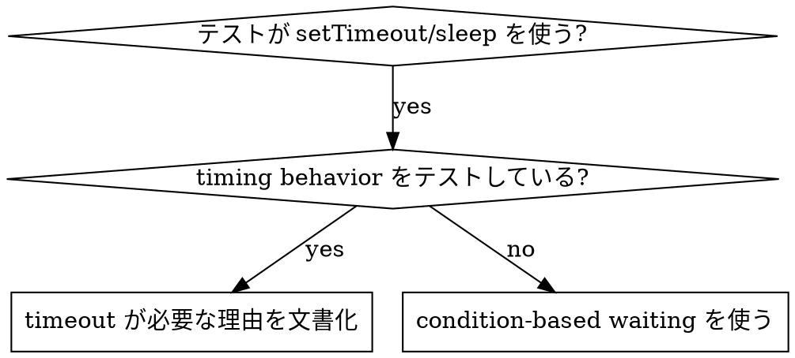

# 条件ベースの待機

## 概要

flaky tests は任意 delay で timing を推測しがちである。これにより、速い machine では通るが負荷下や CI では失敗する race condition が生まれる。

**中核原則:** かかる時間の推測ではなく、本当に気にしている条件を待つ。

## 使うタイミング



**使う場合:**

- テストに任意 delay がある (`setTimeout`, `sleep`, `time.sleep()`)
- テストが flaky
- 並列実行で timeout する
- async operation の完了を待っている

**使わない場合:**

- 実際の timing behavior をテストしている (debounce, throttle intervals)
- 任意 timeout を使うなら、必ず WHY を文書化する

## 中核パターン

```typescript
// BEFORE: timing を推測
await new Promise(r => setTimeout(r, 50));
const result = getResult();
expect(result).toBeDefined();

// AFTER: 条件を待つ
await waitFor(() => getResult() !== undefined);
const result = getResult();
expect(result).toBeDefined();
```

## クイックパターン

| Scenario | Pattern |
|----------|---------|
| event を待つ | `waitFor(() => events.find(e => e.type === 'DONE'))` |
| state を待つ | `waitFor(() => machine.state === 'ready')` |
| count を待つ | `waitFor(() => items.length >= 5)` |
| file を待つ | `waitFor(() => fs.existsSync(path))` |
| 複雑な条件 | `waitFor(() => obj.ready && obj.value > 10)` |

## 実装

汎用 polling function:

```typescript
async function waitFor<T>(
  condition: () => T | undefined | null | false,
  description: string,
  timeoutMs = 5000
): Promise<T> {
  const startTime = Date.now();

  while (true) {
    const result = condition();
    if (result) return result;

    if (Date.now() - startTime > timeoutMs) {
      throw new Error(`Timeout waiting for ${description} after ${timeoutMs}ms`);
    }

    await new Promise(r => setTimeout(r, 10));
  }
}
```

実際のデバッグセッション由来の domain-specific helpers (`waitForEvent`, `waitForEventCount`, `waitForEventMatch`) を含む完全実装は、このディレクトリの `condition-based-waiting-example.ts` を参照。

## よくある間違い

**悪い:** Polling が速すぎる: `setTimeout(check, 1)` - CPU を浪費する  
**修正:** 10ms ごとに poll する

**悪い:** timeout なし - 条件が満たされないと永久 loop  
**修正:** 明確なエラー付き timeout を常に入れる

**悪い:** stale data - loop 前に state を cache する  
**修正:** loop 内で getter を呼び、新鮮な data を取る

## 任意 timeout が正しい時

```typescript
// Tool は 100ms ごとに tick する。partial output 検証に 2 ticks 必要
await waitForEvent(manager, 'TOOL_STARTED'); // まず条件を待つ
await new Promise(r => setTimeout(r, 200));   // 次に timed behavior を待つ
// 200ms = 100ms interval の 2 ticks。文書化され正当化されている
```

**要件:**

1. まず triggering condition を待つ
2. 既知の timing に基づく (推測ではない)
3. WHY を説明するコメントがある

## 実世界での効果

デバッグセッション (2025-10-03) から:

- 3 ファイルで 15 flaky tests を修正
- Pass rate: 60% -> 100%
- Execution time: 40% faster
- race condition 消滅
