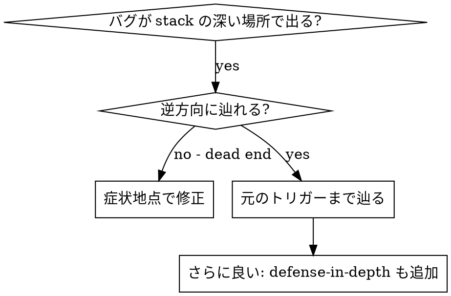
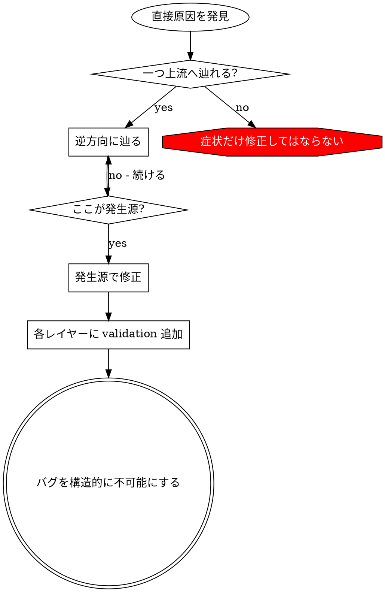

# 根本原因トレース

## 概要

バグは call stack の深い場所で現れることが多い。間違ったディレクトリでの `git init`、間違った場所へのファイル作成、間違った path で database を開く、など。エラーが出た場所で直したくなるが、それは症状を処理しているだけである。

**中核原則:** 元のトリガーを見つけるまで call chain を逆に辿り、発生源で直す。

## 使うタイミング



**使う場合:**

- エラーが entry point ではなく深い実行地点で起きる
- stack trace が長い call chain を示す
- invalid data の発生源が不明
- どの test/code が問題を trigger しているか見つける必要がある

## トレース手順

### 1. 症状を観察する

```text
Error: git init failed in ~/project/packages/core
```

### 2. 直接原因を見つける

**どのコードが直接これを起こしているか?**

```typescript
await execFileAsync('git', ['init'], { cwd: projectDir });
```

### 3. 何がこれを呼んだか尋ねる

```typescript
WorktreeManager.createSessionWorktree(projectDir, sessionId)
  -> called by Session.initializeWorkspace()
  -> called by Session.create()
  -> called by test at Project.create()
```

### 4. 上流へ辿り続ける

**どんな値が渡されたか?**

- `projectDir = ''` (空文字!)
- `cwd` に空文字を渡すと `process.cwd()` として解決される
- つまり source code directory である

### 5. 元のトリガーを見つける

**空文字はどこから来たか?**

```typescript
const context = setupCoreTest(); // Returns { tempDir: '' }
Project.create('name', context.tempDir); // beforeEach 前にアクセス!
```

## Stack Trace を追加する

手で辿れない場合は instrumentation を追加する。

```typescript
async function gitInit(directory: string) {
  const stack = new Error().stack;
  console.error('DEBUG git init:', {
    directory,
    cwd: process.cwd(),
    nodeEnv: process.env.NODE_ENV,
    stack,
  });

  await execFileAsync('git', ['init'], { cwd: directory });
}
```

**重要:** テストでは logger ではなく `console.error()` を使う。logger は表示されないことがある。

```bash
npm test 2>&1 | grep 'DEBUG git init'
```

**stack trace 分析:**

- test file name を探す
- 呼び出し行番号を見つける
- パターンを特定する (同じ test? 同じ parameter?)

## どのテストが汚染するか探す

テスト中に何かが現れるが、どのテストか分からない場合:

このディレクトリの bisection script `find-polluter.sh` を使う。

```bash
./find-polluter.sh '.git' 'src/**/*.test.ts'
```

テストを一つずつ実行し、最初の polluter で停止する。

## 実例: 空の projectDir

**症状:** `.git` が source code の `packages/core/` に作られる

**Trace chain:**

1. `git init` が `process.cwd()` で実行される -> cwd parameter が空
2. WorktreeManager が空の projectDir で呼ばれた
3. Session.create() に空文字が渡された
4. test が beforeEach 前に `context.tempDir` にアクセスした
5. setupCoreTest() は最初 `{ tempDir: '' }` を返す

**根本原因:** top-level variable initialization が空値にアクセスしていた

**修正:** beforeEach 前にアクセスすると throw する getter にした

**追加した defense-in-depth:**

- Layer 1: Project.create() が directory を validate
- Layer 2: WorkspaceManager が空でないことを validate
- Layer 3: NODE_ENV guard が tmpdir 外の git init を拒否
- Layer 4: git init 前の stack trace logging

## 重要原則



**エラーが現れた場所だけで直してはならない。** 元のトリガーを見つけるために辿る。

## Stack Trace Tips

**テストでは:** logger ではなく `console.error()` を使う。  
**操作前に:** 危険操作の前に log する。失敗後では遅い。  
**文脈を含める:** directory, cwd, environment variables, timestamps。  
**stack を取る:** `new Error().stack` が完全な call chain を示す。

## 実世界での効果

デバッグセッション (2025-10-03) から:

- 5 レベルの trace で root cause を発見
- 発生源で修正 (getter validation)
- 4 層の defense を追加
- 1847 tests passed、汚染ゼロ
