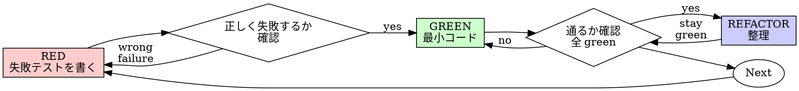

# テスト駆動開発 (TDD)

## 概要

先にテストを書く。失敗するところを見る。通すための最小コードを書く。

**中核原則:** テストが失敗するのを見ていないなら、それが正しいものをテストしているか分からない。

**ルールの字面に違反することは、ルールの精神に違反することである。**

## 使うタイミング

**常に:**

- 新機能
- バグ修正
- リファクタリング
- 挙動変更

**例外 (human partner に確認する):**

- 使い捨てプロトタイプ
- 生成コード
- 設定ファイル

「今回だけ TDD を飛ばそう」と考えたら停止する。それは合理化である。

## 鉄則

```text
失敗するテストが先にない本番コードは禁止
```

テストより先にコードを書いたか。削除して、やり直す。

**例外なし:**

- 「参考」として残さない
- テストを書きながら「適応」しない
- 見返さない
- 削除とは削除である

テストから新しく実装する。それだけ。

## Red-Green-Refactor



### RED - 失敗テストを書く

起きるべきことを示す、最小のテストを一つ書く。

<Good>

```typescript
test('retries failed operations 3 times', async () => {
  let attempts = 0;
  const operation = () => {
    attempts++;
    if (attempts < 3) throw new Error('fail');
    return 'success';
  };

  const result = await retryOperation(operation);

  expect(result).toBe('success');
  expect(attempts).toBe(3);
});
```

明確な名前、実際の挙動、一つのことをテストしている。
</Good>

<Bad>

```typescript
test('retry works', async () => {
  const mock = jest.fn()
    .mockRejectedValueOnce(new Error())
    .mockRejectedValueOnce(new Error())
    .mockResolvedValueOnce('success');
  await retryOperation(mock);
  expect(mock).toHaveBeenCalledTimes(3);
});
```

曖昧な名前で、コードではなく mock をテストしている。
</Bad>

**要件:**

- 一つの挙動
- 明確な名前
- 実コード (避けられない場合以外 mock なし)

### Verify RED - 失敗を見る

**必須。絶対に飛ばさない。**

```bash
npm test path/to/test.test.ts
```

確認する:

- テストが失敗する (エラーではない)
- 失敗メッセージが期待通り
- typo ではなく、機能不足で失敗している

**テストが通った?** 既存挙動をテストしている。テストを直す。

**テストがエラー?** エラーを直し、正しく失敗するまで再実行する。

### GREEN - 最小コード

テストを通す最も単純なコードを書く。

<Good>

```typescript
async function retryOperation<T>(fn: () => Promise<T>): Promise<T> {
  for (let i = 0; i < 3; i++) {
    try {
      return await fn();
    } catch (e) {
      if (i === 2) throw e;
    }
  }
  throw new Error('unreachable');
}
```

通すために十分。
</Good>

<Bad>

```typescript
async function retryOperation<T>(
  fn: () => Promise<T>,
  options?: {
    maxRetries?: number;
    backoff?: 'linear' | 'exponential';
    onRetry?: (attempt: number) => void;
  }
): Promise<T> {
  // YAGNI
}
```

過剰設計。
</Bad>

テストが要求する以上の機能追加、他コードのリファクタリング、「改善」はしない。

### Verify GREEN - 通るところを見る

**必須。**

```bash
npm test path/to/test.test.ts
```

確認する:

- テストが通る
- 他のテストもまだ通る
- 出力がきれい (エラーや警告なし)

**テスト失敗?** テストではなくコードを直す。

**他のテスト失敗?** 今直す。

### REFACTOR - 整理する

green の後だけ:

- 重複を消す
- 名前を改善する
- ヘルパーを抽出する

テストは green のまま保つ。挙動は追加しない。

### 繰り返す

次の機能には次の失敗テストを書く。

## 良いテスト

| 品質 | 良い | 悪い |
|------|------|------|
| **最小** | 一つのこと。名前に "and" があれば分割する。 | `test('validates email and domain and whitespace')` |
| **明確** | 名前が挙動を説明する | `test('test1')` |
| **意図を示す** | 望む API を実演する | コードが何をすべきかを隠す |

## なぜ順序が重要か

**「動くことを確認するため後でテストを書く」**

コード後に書いたテストはすぐ通る。すぐ通ることは何も証明しない。

- 間違ったものをテストしているかもしれない
- 挙動ではなく実装をテストしているかもしれない
- 忘れた edge case を逃すかもしれない
- そのテストがバグを捕まえるところを見ていない

テストファーストは、テストが失敗するのを見ることを強制し、実際に何かをテストしていることを証明する。

**「edge case は全部手動で確認した」**

手動テストは場当たり的である。

- 何をテストしたか記録がない
- コード変更時に再実行できない
- 圧力下ではケースを忘れやすい
- 「試したら動いた」は網羅的ではない

自動テストは体系的で、毎回同じように走る。

**「X 時間の作業を消すのは無駄」**

サンクコスト錯誤である。その時間はもう戻らない。今の選択肢は:

- 削除して TDD で書き直す (さらに X 時間、高信頼)
- 残して後からテストを書く (30 分、低信頼、バグが残りやすい)

「無駄」なのは、信頼できないコードを残すこと。実テストのない動作コードは技術的負債である。

**「TDD は教条的。実用的なら適応する」**

TDD は実用的である。

- コミット前にバグを見つける
- 回帰を防ぐ
- 挙動を文書化する
- リファクタリングを可能にする

「実用的」な近道 = 本番でデバッグ = 遅い。

**「後からテストでも同じ目的を達成する」**

違う。テスト後は「これは何をするか」に答える。テスト先は「これは何をすべきか」に答える。

テスト後は実装に偏る。必要なものではなく作ったものをテストする。思い出した edge case を検証するだけで、発見したものではない。

テストファーストは実装前に edge case 発見を強制する。テスト後は全部覚えていたかを検証するだけで、覚えていない。

30 分の後付けテストは TDD ではない。カバレッジは得るが、テストが機能する証明を失う。

## よくある合理化

| 言い訳 | 現実 |
|--------|------|
| 「単純すぎてテスト不要」 | 単純なコードも壊れる。テストは 30 秒。 |
| 「後でテストする」 | すぐ通るテストは何も証明しない。 |
| 「後テストでも同じ目的」 | 後テスト = 何をするか。先テスト = 何をすべきか。 |
| 「手動で確認済み」 | 場当たり的で体系的ではない。記録なし、再実行不可。 |
| 「X 時間消すのは無駄」 | サンクコスト錯誤。未検証コードを残す方が負債。 |
| 「参考として残し、テストファーストにする」 | それを適応してしまう。それは後テスト。削除とは削除。 |
| 「先に探索が必要」 | よい。探索結果は捨て、TDD で始める。 |
| 「テストが難しい = 設計が不明確」 | テストに耳を傾ける。テストしにくい = 使いにくい。 |
| 「TDD は遅い」 | TDD はデバッグより速い。実用的 = テストファースト。 |
| 「手動テストの方が速い」 | 手動では edge case を証明できない。変更ごとに再テストが必要。 |
| 「既存コードにテストがない」 | 改善している。既存コード用テストを追加する。 |

## 危険信号 - 停止してやり直す

- テスト前にコードを書いた
- 実装後にテストを書いた
- テストが即座に通った
- なぜ失敗したか説明できない
- テストを「後で」追加した
- 「今回だけ」と合理化している
- 「手動で確認した」
- 「後テストでも同じ」
- 「精神が大事で儀式ではない」
- 「参考として残す」または「既存コードを適応」
- 「もう X 時間使った。消すのは無駄」
- 「TDD は教条的。自分は実用的にやる」
- 「これは特別」

**これらはすべて、コードを削除して TDD でやり直す合図である。**

## 例: バグ修正

**Bug:** 空メールが受け入れられる

**RED**

```typescript
test('rejects empty email', async () => {
  const result = await submitForm({ email: '' });
  expect(result.error).toBe('Email required');
});
```

**Verify RED**

```bash
$ npm test
FAIL: expected 'Email required', got undefined
```

**GREEN**

```typescript
function submitForm(data: FormData) {
  if (!data.email?.trim()) {
    return { error: 'Email required' };
  }
  // ...
}
```

**Verify GREEN**

```bash
$ npm test
PASS
```

**REFACTOR**

必要なら複数フィールドの validation を抽出する。

## 検証チェックリスト

完了扱いする前に:

- [ ] 新しい関数/メソッドすべてにテストがある
- [ ] 実装前に各テストが失敗するのを見た
- [ ] 各テストが期待理由で失敗した (feature missing、typo ではない)
- [ ] 各テストを通す最小コードを書いた
- [ ] すべてのテストが通る
- [ ] 出力がきれい (エラーや警告なし)
- [ ] テストは実コードを使う (避けられない場合以外 mock なし)
- [ ] edge case と error をカバーした

すべてチェックできないなら、TDD を飛ばしている。やり直す。

## 詰まった時

| 問題 | 解決 |
|------|------|
| テスト方法が分からない | 望む API を書く。先に assertion を書く。human partner に尋ねる。 |
| テストが複雑すぎる | 設計が複雑すぎる。インターフェースを単純化する。 |
| すべて mock しなければならない | コードが密結合。依存性注入を使う。 |
| テスト準備が巨大 | ヘルパーを抽出する。それでも複雑なら設計を単純化する。 |

## デバッグとの統合

バグを見つけたら、それを再現する失敗テストを書く。TDD サイクルに従う。テストが修正を証明し、回帰を防ぐ。

テストなしにバグを修正してはならない。

## テストのアンチパターン

mock やテストユーティリティを追加する時は、よくある落とし穴を避けるため `@testing-anti-patterns.md` を読む。

- 実挙動ではなく mock 挙動をテストする
- production class に test-only メソッドを追加する
- 依存関係を理解せず mock する

## 最終ルール

```text
本番コード -> テストが存在し、先に失敗している
それ以外 -> TDD ではない
```

human partner の許可なしに例外はない。
