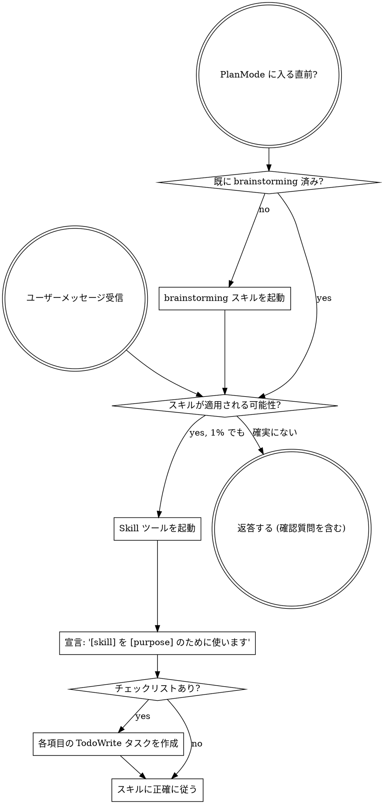

<SUBAGENT-STOP>
特定タスクを実行するサブエージェントとして呼び出された場合は、このスキルをスキップする。
</SUBAGENT-STOP>

<EXTREMELY-IMPORTANT>
今していることにスキルが適用される可能性が 1% でもあると思うなら、必ずそのスキルを起動すること。

スキルがタスクに適用されるなら、選択肢はない。必ず使う。

これは交渉事項ではない。任意ではない。理屈を付けて回避してはならない。
</EXTREMELY-IMPORTANT>

## 指示の優先順位

Superpowers のスキルは既定のシステムプロンプトより優先されるが、**ユーザー指示は常に最優先**である。

1. **ユーザーの明示指示** (`CLAUDE.md`, `GEMINI.md`, `AGENTS.md`, 直接依頼) - 最優先
2. **Superpowers スキル** - 競合する場合、既定のシステム挙動を上書きする
3. **既定のシステムプロンプト** - 最低優先

`CLAUDE.md`、`GEMINI.md`、`AGENTS.md` が「TDD を使うな」と言い、スキルが「常に TDD を使え」と言う場合は、ユーザー指示に従う。主導権はユーザーにある。

## スキルへのアクセス方法

**Claude Code:** `Skill` ツールを使う。スキルを起動すると内容が読み込まれて提示されるので、それに直接従う。スキルファイルを Read ツールで読んではならない。

**Copilot CLI:** `skill` ツールを使う。インストール済みプラグインからスキルが自動検出される。`skill` ツールは Claude Code の `Skill` ツールと同じように動作する。

**Gemini CLI:** `activate_skill` ツールでスキルを有効化する。Gemini はセッション開始時にスキルのメタデータを読み込み、必要に応じて全文を有効化する。

**その他の環境:** スキルの読み込み方法は各プラットフォームのドキュメントを確認する。

## プラットフォーム適応

スキルは Claude Code のツール名を使う。Claude Code 以外では、ツール対応表として `references/copilot-tools.md` (Copilot CLI)、`references/codex-tools.md` (Codex) を参照する。Gemini CLI では GEMINI.md により対応表が自動で読み込まれる。

# スキルの使い方

## ルール

**関連する、または要求されたスキルは、返答や行動の前に起動する。** スキルが適用される可能性が 1% でもあるなら、確認のため起動する。起動したスキルが状況に合わないと分かった場合は、使わなくてよい。

## 危険信号

以下の考えが浮かんだら停止する。合理化しようとしている。

| 考え | 現実 |
|------|------|
| 「これは単純な質問だ」 | 質問もタスク。スキルを確認する。 |
| 「先にもう少し文脈が必要だ」 | スキル確認は確認質問より前。 |
| 「先にコードベースを探索しよう」 | 探索方法はスキルが教える。先に確認。 |
| 「git やファイルだけ素早く見ればいい」 | ファイルには会話文脈がない。スキルを確認。 |
| 「先に情報収集しよう」 | 情報収集の方法はスキルが教える。 |
| 「正式なスキルはいらない」 | スキルが存在するなら使う。 |
| 「このスキルは覚えている」 | スキルは変わる。現在版を読む。 |
| 「これはタスクではない」 | 行動はタスク。スキルを確認。 |
| 「スキルは大げさだ」 | 単純なことは複雑化する。使う。 |
| 「今回だけ先にやろう」 | 何かをする前に確認する。 |
| 「これは生産的に見える」 | 規律のない行動は時間を浪費する。スキルが防ぐ。 |
| 「意味は分かっている」 | 概念を知っていることは、スキルを使うことではない。起動する。 |

## スキルの優先順位

複数のスキルが適用されそうな場合は、この順で使う。

1. **プロセス系スキルを先に** (brainstorming, debugging) - タスクへの取り組み方を決める
2. **実装系スキルを次に** (frontend-design, mcp-builder) - 実行を導く

「X を作ろう」→ まず brainstorming、その後に実装スキル。  
「このバグを直して」→ まず debugging、その後に領域固有スキル。

## スキルの種類

**厳格** (TDD, debugging): 正確に従う。規律を崩すように適応してはならない。

**柔軟** (patterns): 原則を文脈に合わせて適用する。

スキル自体がどちらかを示す。

## ユーザー指示

指示は WHAT を示すもので、HOW を省略してよいという意味ではない。「X を追加して」「Y を直して」は、ワークフローを飛ばしてよいという意味ではない。
