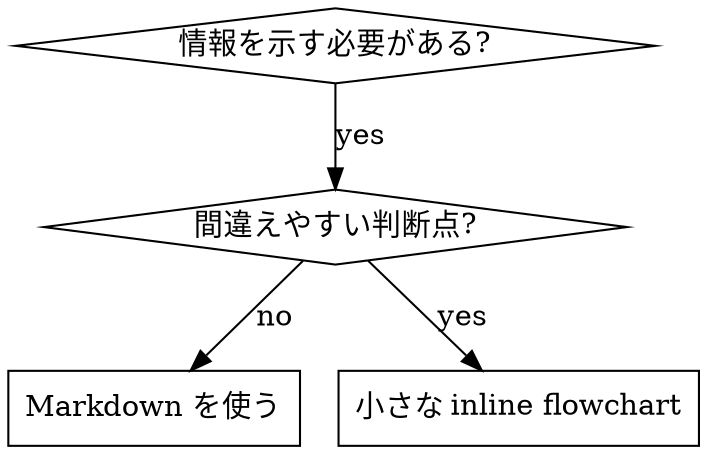

# スキルを書く

## 概要

**スキルを書くことは、プロセス文書に適用したテスト駆動開発である。**

**個人スキルはエージェント固有ディレクトリに置く (Claude Code は `~/.claude/skills`、Codex は `~/.agents/skills/`)**

テストケース (サブエージェントによる圧力シナリオ) を書き、失敗を見る (baseline behavior)。スキルを書く (documentation)。テストが通るのを見る (エージェントが従う)。そしてリファクタする (抜け穴を塞ぐ)。

**中核原則:** スキルなしでエージェントが失敗するのを見ていないなら、そのスキルが正しいことを教えているか分からない。

**必須背景:** このスキルを使う前に superpowers:test-driven-development を理解していること。TDD スキルは基本の RED-GREEN-REFACTOR サイクルを定義する。このスキルはそれを文書へ適用する。

**公式ガイダンス:** Anthropic の公式スキル作成ベストプラクティスは anthropic-best-practices.md を参照する。この文書は TDD 重視のアプローチを補完する追加パターンとガイドラインである。

## スキルとは何か

**スキル**は、実証済みの技法、パターン、ツールの参照ガイドである。将来の Claude インスタンスが効果的なアプローチを見つけ、適用するのを助ける。

**スキルであるもの:** 再利用可能な技法、パターン、ツール、参照ガイド。

**スキルではないもの:** 一度問題を解いた経緯の物語。

## スキル作成への TDD 対応

| TDD 概念 | スキル作成 |
|----------|------------|
| **テストケース** | サブエージェントによる圧力シナリオ |
| **本番コード** | スキル文書 (SKILL.md) |
| **テスト失敗 (RED)** | スキルなしでエージェントがルール違反する |
| **テスト成功 (GREEN)** | スキルありでエージェントが従う |
| **リファクタ** | 従順さを保ったまま抜け穴を塞ぐ |
| **先にテストを書く** | スキル作成前に baseline scenario を実行する |
| **失敗を見る** | エージェントの合理化を正確に記録する |
| **最小コード** | その違反に対応するスキルを書く |
| **成功を見る** | エージェントが従うことを検証する |
| **リファクタサイクル** | 新しい合理化を見つけ、塞ぎ、再検証する |

スキル作成プロセス全体は RED-GREEN-REFACTOR に従う。

## スキルを作るタイミング

**作る場合:**

- 技法が直感的に明らかではなかった
- プロジェクトをまたいで再参照したい
- 広く適用できる (プロジェクト固有ではない)
- 他の人にも役立つ

**作らない場合:**

- 一回限りの解決策
- 他で十分文書化された標準プラクティス
- プロジェクト固有の慣習 (`CLAUDE.md` に入れる)
- 機械的制約 (regex/validation で強制できるなら自動化する。文書は判断が必要なものに使う)

## スキルの種類

### Technique

従うべき具体的手順 (condition-based-waiting, root-cause-tracing)。

### Pattern

問題の考え方 (flatten-with-flags, test-invariants)。

### Reference

API docs、構文ガイド、ツールドキュメント。

## ディレクトリ構造

```text
skills/
  skill-name/
    SKILL.md              # メイン参照 (必須)
    supporting-file.*     # 必要な場合のみ
```

**フラット名前空間** - すべてのスキルは一つの検索可能な名前空間にある。

**別ファイルにするもの:**

1. **重い参照** (100+ 行) - API docs、包括的構文
2. **再利用可能ツール** - scripts、utilities、templates

**inline に保つもの:**

- 原則と概念
- コードパターン (< 50 行)
- その他すべて

## SKILL.md 構造

**Frontmatter (YAML):**

- 必須フィールドは `name` と `description` の二つ
- 合計最大 1024 文字
- `name`: 英数字とハイフンのみ
- `description`: 三人称で、いつ使うかだけを説明する
  - "Use when..." で始め、triggering conditions に集中する
  - 症状、状況、文脈を具体的に含める
  - **スキルのプロセスやワークフローを要約しない**
  - 可能なら 500 文字未満

```markdown
---
name: skill-name-with-hyphens
description: Use when [specific triggering conditions and symptoms]
---

# Skill Name

## Overview
これは何か。中核原則を 1-2 文で。

## When to Use
[判断が非自明なら小さな inline flowchart]

症状と use cases の箇条書き
使わない時

## Core Pattern
before/after code comparison

## Quick Reference
よく使う操作を表や箇条書きで

## Implementation
単純なパターンは inline code
重い参照や再利用ツールはファイルへリンク

## Common Mistakes
何が悪くなるか + 修正

## Real-World Impact (optional)
具体的成果
```

## Claude Search Optimization (CSO)

**発見性に重要:** 将来の Claude がスキルを見つける必要がある。

### 1. Rich Description Field

**目的:** Claude は description を読み、タスクに対してどのスキルを読むか判断する。問いは「今このスキルを読むべきか?」

**形式:** "Use when..." で始め、triggering conditions に集中する。

**重要: description = いつ使うか。スキルが何をするかではない。**

description は triggering conditions だけを説明する。プロセスやワークフローを要約してはならない。

**なぜ重要か:** テストで、description がワークフローを要約すると、Claude が全文を読まず description だけに従うことが分かった。たとえば "code review between tasks" とあると、本文では二段階レビューと明記していても、1 回だけレビューした。

description を "Use when executing implementation plans with independent tasks" のように trigger だけにすると、Claude は flowchart を読み、二段階レビューに従った。

**罠:** ワークフローを要約する description は、Claude が取る shortcut になる。本文が読まれない文書になる。

```yaml
# BAD: ワークフロー要約。Claude が本文を読まず従う可能性
description: Use when executing plans - dispatches subagent per task with code review between tasks

# BAD: プロセス詳細が多すぎる
description: Use for TDD - write test first, watch it fail, write minimal code, refactor

# GOOD: triggering conditions だけ
description: Use when executing implementation plans with independent tasks in the current session

# GOOD: triggering conditions だけ
description: Use when implementing any feature or bugfix, before writing implementation code
```

**内容:**

- スキル適用を示す具体的 trigger、症状、状況を使う
- 言語固有症状ではなく問題を説明する
- スキルが技術固有でない限り technology-agnostic にする
- 技術固有スキルなら trigger で明示する
- 三人称で書く
- **スキルのプロセスやワークフローを要約しない**

### 2. Keyword Coverage

Claude が検索しそうな言葉を使う。

- エラーメッセージ: "Hook timed out", "ENOTEMPTY", "race condition"
- 症状: "flaky", "hanging", "zombie", "pollution"
- 類義語: "timeout/hang/freeze", "cleanup/teardown/afterEach"
- ツール: 実際のコマンド、ライブラリ名、ファイル種別

### 3. Descriptive Naming

**能動態、動詞優先を使う:**

- `creating-skills`、`skill-creation` ではない
- `condition-based-waiting`、`async-test-helpers` ではない

### 4. Token Efficiency

頻繁に読み込まれるスキルは毎会話に入る。すべての token が重要。

**目標語数:**

- getting-started workflows: 各 <150 words
- 頻繁に読み込まれるスキル: 合計 <200 words
- その他スキル: <500 words

**技法:**

- 詳細は tool help へ移す
- 他スキルへの cross-reference を使う
- 例を圧縮する
- 重複を削除する

**検証:**

```bash
wc -w skills/path/SKILL.md
```

**名前は「何をするか」または中核 insight で付ける:**

- `condition-based-waiting` > `async-test-helpers`
- `using-skills` > `skill-usage`
- `flatten-with-flags` > `data-structure-refactoring`
- `root-cause-tracing` > `debugging-techniques`

**-ing 形はプロセス名に向いている:**

- `creating-skills`, `testing-skills`, `debugging-with-logs`

### 5. 他スキルの参照

他スキルを参照する文書を書く時:

- 良い: `**REQUIRED SUB-SKILL:** Use superpowers:test-driven-development`
- 良い: `**REQUIRED BACKGROUND:** You MUST understand superpowers:systematic-debugging`
- 悪い: `See skills/testing/test-driven-development`
- 悪い: `@skills/testing/test-driven-development/SKILL.md`

**@ links を避ける理由:** `@` 構文はファイルを即座に force-load し、必要前に大きな文脈を消費する。

## Flowchart Usage



**flowchart を使うのは以下のみ:**

- 非自明な判断点
- 早く止まりすぎる可能性がある process loop
- 「A と B のどちらを使うか」の判断

**flowchart にしないもの:**

- 参照資料
- コード例
- 線形手順
- 意味のない label

graphviz の style rule は `graphviz-conventions.dot` を参照。

human partner に可視化する場合、このディレクトリの `render-graphs.js` で flowchart を SVG に render する。

```bash
./render-graphs.js ../some-skill
./render-graphs.js ../some-skill --combine
```

## コード例

**優れた例一つは、凡庸な例多数に勝る。**

関連する言語を選ぶ:

- Testing techniques -> TypeScript/JavaScript
- System debugging -> Shell/Python
- Data processing -> Python

**良い例:**

- 完全で実行可能
- WHY を説明するコメント付き
- 実シナリオ由来
- パターンを明確に示す
- 適応しやすい

**避ける:**

- 5+ 言語で実装する
- 穴埋めテンプレートを作る
- わざとらしい例を書く

## ファイル構成

### Self-Contained Skill

```text
defense-in-depth/
  SKILL.md
```

すべて inline に収まり、重い参照が不要な場合。

### Reusable Tool 付き Skill

```text
condition-based-waiting/
  SKILL.md
  example.ts
```

ツールが narrative ではなく再利用可能コードの場合。

### Heavy Reference 付き Skill

```text
pptx/
  SKILL.md
  pptxgenjs.md
  ooxml.md
  scripts/
```

参照資料が inline には大きすぎる場合。

## 鉄則 (TDD と同じ)

```text
失敗テストなしにスキルを書いてはならない
```

これは新規スキルにも既存スキル編集にも適用される。

テスト前にスキルを書いたか。削除してやり直す。テストなしで編集したか。同じ違反である。

**例外なし:**

- 「単純な追加」でも不可
- 「セクション追加だけ」でも不可
- 「ドキュメント更新」でも不可
- 未テスト変更を「参考」として残さない
- テスト中に「適応」しない
- 削除とは削除

## スキルタイプ別のテスト

### Discipline-Enforcing Skills

例: TDD, verification-before-completion, designing-before-coding

**テスト方法:**

- 学術的質問: ルールを理解するか
- 圧力シナリオ: ストレス下で従うか
- 複数圧力の組み合わせ: time + sunk cost + exhaustion
- 合理化を特定し、明示的 counter を追加する

**成功基準:** 最大圧力下でもルールに従う。

### Technique Skills

例: condition-based-waiting, root-cause-tracing, defensive-programming

**テスト方法:**

- 適用シナリオ: 技法を正しく適用できるか
- 変種シナリオ: edge cases を扱えるか
- 情報不足テスト: 指示に gaps がないか

**成功基準:** 新しいシナリオに技法を適用できる。

### Pattern Skills

例: reducing-complexity, information-hiding concepts

**テスト方法:**

- 認識シナリオ: パターン適用時を認識するか
- 適用シナリオ: mental model を使えるか
- counter-examples: 適用しない時を知っているか

**成功基準:** when/how を正しく判断する。

### Reference Skills

例: API documentation, command references, library guides

**テスト方法:**

- retrieval scenarios: 必要情報を見つけられるか
- application scenarios: 見つけた情報を正しく使えるか
- gap testing: よくある use cases が covered か

**成功基準:** 参照情報を見つけ、正しく適用する。

## テストを飛ばす合理化

| 言い訳 | 現実 |
|--------|------|
| 「スキルは明らかに分かりやすい」 | 自分に明確でも他エージェントに明確とは限らない。テストする。 |
| 「ただの参照」 | 参照にも gaps や不明確さがある。retrieval をテストする。 |
| 「テストは大げさ」 | 未テストスキルには必ず問題がある。15 分のテストが数時間を節約する。 |
| 「問題が出たらテストする」 | 問題 = エージェントが使えない。デプロイ前にテストする。 |
| 「面倒」 | production の悪いスキルをデバッグする方が面倒。 |
| 「自信がある」 | 過信は issue を保証する。テストする。 |
| 「academic review で十分」 | 読むことと使うことは違う。application scenario をテストする。 |
| 「時間がない」 | 未テストスキルのデプロイは後でもっと時間を浪費する。 |

**すべて、デプロイ前にテストせよという合図である。例外なし。**

## 合理化に強いスキルにする

TDD のような規律強制スキルは、合理化に耐える必要がある。エージェントは賢く、圧力下では抜け穴を探す。

**心理学メモ:** 説得技法がなぜ効くか理解すると、体系的に適用できる。authority、commitment、scarcity、social proof、unity の研究基盤は `persuasion-principles.md` を参照。

### 抜け穴をすべて明示的に塞ぐ

ルールを述べるだけでなく、具体的な回避策を禁止する。

<Bad>

```markdown
Write code before test? Delete it.
```

</Bad>

<Good>

```markdown
Write code before test? Delete it. Start over.

**No exceptions:**
- Don't keep it as "reference"
- Don't "adapt" it while writing tests
- Don't look at it
- Delete means delete
```

</Good>

### "Spirit vs Letter" を封じる

早い段階で基礎原則を追加する。

```markdown
**Violating the letter of the rules is violating the spirit of the rules.**
```

### 合理化テーブルを作る

baseline testing で得た合理化を記録する。エージェントが言った言い訳をすべて表に入れる。

```markdown
| Excuse | Reality |
|--------|---------|
| "Too simple to test" | Simple code breaks. Test takes 30 seconds. |
| "I'll test after" | Tests passing immediately prove nothing. |
```

### Red Flags リストを作る

エージェントが自分で合理化を検出しやすくする。

```markdown
## Red Flags - STOP and Start Over

- Code before test
- "I already manually tested it"
- "Tests after achieve the same purpose"

**All of these mean: Delete code. Start over with TDD.**
```

## RED-GREEN-REFACTOR for Skills

### RED: 失敗テストを書く (Baseline)

スキルなしでサブエージェントに圧力シナリオを実行する。正確な挙動を記録する。

- どんな選択をしたか
- どんな合理化を使ったか
- どの圧力が違反を引き起こしたか

これが「テストが失敗するのを見る」である。スキルを書く前に、エージェントが自然に何をするかを見る必要がある。

### GREEN: 最小スキルを書く

その具体的な合理化に対応するスキルを書く。仮定上のケースへ余計な内容を追加しない。

同じシナリオをスキルありで実行する。エージェントは従うべきである。

### REFACTOR: 抜け穴を塞ぐ

新しい合理化を見つけたか。明示的 counter を追加する。bulletproof になるまで再テストする。

完全なテスト方法は `testing-skills-with-subagents.md` を参照。

## アンチパターン

### 悪い: Narrative Example

"In session 2025-10-03, we found empty projectDir caused..."

**なぜ悪いか:** 具体的すぎて再利用できない。

### 悪い: Multi-Language Dilution

example-js.js, example-py.py, example-go.go

**なぜ悪いか:** 品質が凡庸になり、保守負担が増える。

### 悪い: Code in Flowcharts

```dot
step1 [label="import fs"];
step2 [label="read file"];
```

**なぜ悪いか:** copy-paste できず読みにくい。

### 悪い: Generic Labels

helper1, helper2, step3, pattern4

**なぜ悪いか:** label には意味があるべき。

## STOP: 次のスキルへ進む前に

**どのスキルを書いた後も、必ず停止して deployment process を完了する。**

**してはならない:**

- 各スキルをテストせず複数スキルを batch 作成する
- 現在スキルを検証する前に次へ進む
- 「batching が効率的」としてテストを飛ばす

以下の deployment checklist は各スキルで必須。

未テストスキルのデプロイ = 未テストコードのデプロイ。品質基準違反である。

## Skill Creation Checklist

**重要: 以下の各項目に TodoWrite todo を作る。**

**RED Phase - 失敗テストを書く:**

- [ ] 圧力シナリオを作る (discipline skills は 3+ combined pressures)
- [ ] スキルなしでシナリオ実行し、baseline behavior を verbatim 記録する
- [ ] 合理化/失敗のパターンを特定する

**GREEN Phase - 最小スキルを書く:**

- [ ] 名前は英数字とハイフンのみ
- [ ] YAML frontmatter に必須 `name` と `description` がある
- [ ] description は "Use when..." で始まり、specific triggers/symptoms を含む
- [ ] description は三人称
- [ ] 検索用 keyword を全体に含める
- [ ] 中核原則を含む明確な overview
- [ ] RED で特定した具体的 baseline failures に対応する
- [ ] code は inline または別ファイルへ link
- [ ] 優れた例を一つ入れる
- [ ] スキルありでシナリオ実行し、従うことを検証する

**REFACTOR Phase - 抜け穴を塞ぐ:**

- [ ] テストから新しい合理化を特定する
- [ ] explicit counters を追加する
- [ ] 全テスト反復から rationalization table を作る
- [ ] red flags list を作る
- [ ] bulletproof になるまで再テストする

**Quality Checks:**

- [ ] decision が非自明な場合のみ小さな flowchart
- [ ] quick reference table
- [ ] common mistakes section
- [ ] narrative storytelling なし
- [ ] supporting files は tools または heavy reference のみ

**Deployment:**

- [ ] skill を git に commit し、fork へ push する
- [ ] 広く役立つなら upstream PR を検討する

## Discovery Workflow

将来の Claude がスキルを見つける流れ:

1. **問題に遭遇する** ("tests are flaky")
2. **SKILL を見つける** (description が一致)
3. **overview を読む** (関連するか?)
4. **patterns を読む** (quick reference table)
5. **example を読み込む** (実装時のみ)

この flow に最適化する。検索語を早く、頻繁に置く。

## 結論

**スキル作成は、プロセス文書の TDD である。**

同じ鉄則: 失敗テストなしにスキルなし。  
同じサイクル: RED (baseline) -> GREEN (write skill) -> REFACTOR (close loopholes)。  
同じ利点: 品質向上、驚きの減少、bulletproof な結果。

コードで TDD に従うなら、スキルでも従う。同じ規律を文書へ適用する。
